# Diagramas de Flujo - Módulo de Comunicaciones

## 1. Diagrama de Casos de Uso

```mermaid
graph TB
    Admin[👑 Administrador]
    Support[👨‍💻 Soporte]
    User[👤 Empleado]

    subgraph "Módulo de Comunicaciones"
        direction TB

        subgraph "Lectura Todos"
            UC1[Ver Comunicaciones]
            UC2[Buscar Comunicaciones]
            UC3[Filtrar por Tipo]
            UC4[Ver Detalle Completo]
            UC5[Marcar como Leído]
            UC6[Ver No Leídas]
        end

        subgraph "Gestión ADMIN"
            UC7[Crear Comunicación]
            UC8[Editar Comunicación]
            UC9[Eliminar Comunicación]
            UC10[Gestionar Visibilidad]
            UC11[Publicar para Roles]
            UC12[Publicar para Departamentos]
            UC13[Ver Estadísticas Lectura]
        end
    end

    User --> UC1
    User --> UC2
    User --> UC3
    User --> UC4
    User --> UC5
    User --> UC6

    Support --> UC1
    Support --> UC2
    Support --> UC3
    Support --> UC4
    Support --> UC5
    Support --> UC6

    Admin --> UC1
    Admin --> UC2
    Admin --> UC3
    Admin --> UC4
    Admin --> UC5
    Admin --> UC6
    Admin --> UC7
    Admin --> UC8
    Admin --> UC9
    Admin --> UC10
    Admin --> UC11
    Admin --> UC12
    Admin --> UC13

    style User fill:#a8dadc
    style Support fill:#457b9d
    style Admin fill:#e63946
    style UC7 fill:#ffe66d
    style UC8 fill:#ffe66d
    style UC9 fill:#ffe66d
```

## 2. Tipos de Comunicaciones

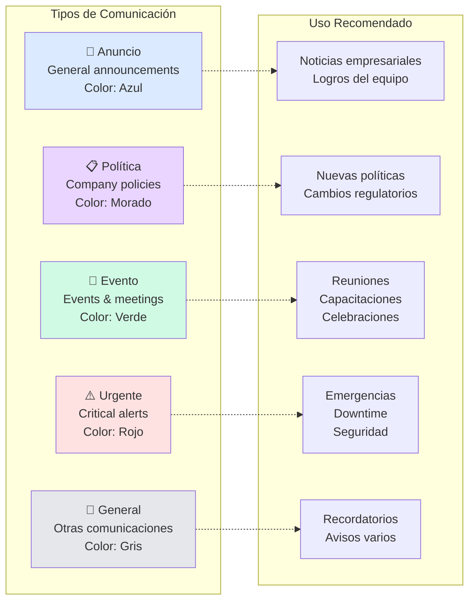

## 3. Flujo de Creación de Comunicación

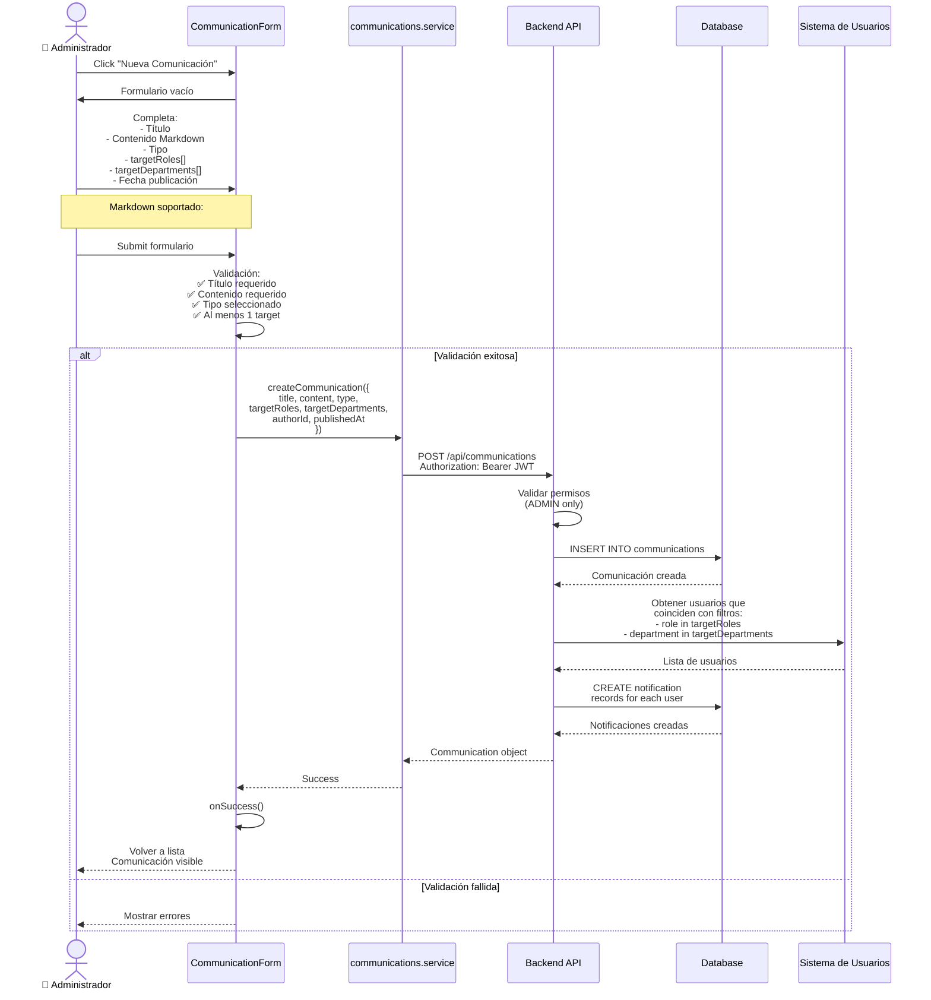

## 4. Sistema de Filtrado de Audiencia

```mermaid
flowchart TD
    A[Admin crea comunicación] --> B{Seleccionar audiencia}

    B --> C[targetRoles]
    B --> D[targetDepartments]

    C --> E{Roles seleccionados?}
    E -->|Todos| F[roles: 'all']
    E -->|Específicos| G[roles: ['admin', 'empleado']]

    D --> H{Departamentos?}
    H -->|Todos| I[departments: 'all']
    H -->|Específicos| J[departments: ['TI', 'RRHH', 'Ventas']]

    F --> K[Combinar filtros<br/>con AND logic]
    G --> K
    I --> K
    J --> K

    K --> L{Cuando usuario<br/>consulta comunicaciones}

    L --> M[Filtrar:<br/>- role in targetRoles<br/>OR targetRoles = 'all']

    M --> N[Filtrar:<br/>- department in targetDepartments<br/>OR targetDepartments = 'all']

    N --> O[Retornar comunicaciones<br/>relevantes para usuario]

    O --> P[Mostrar en lista]

    style P fill:#ccffcc
```

## 5. Arquitectura del Módulo

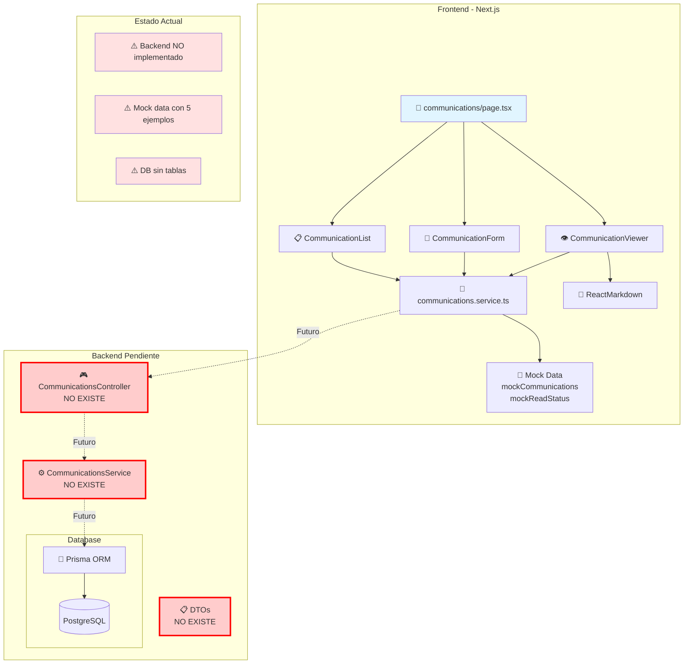

## 6. Flujo de Lectura de Comunicaciones

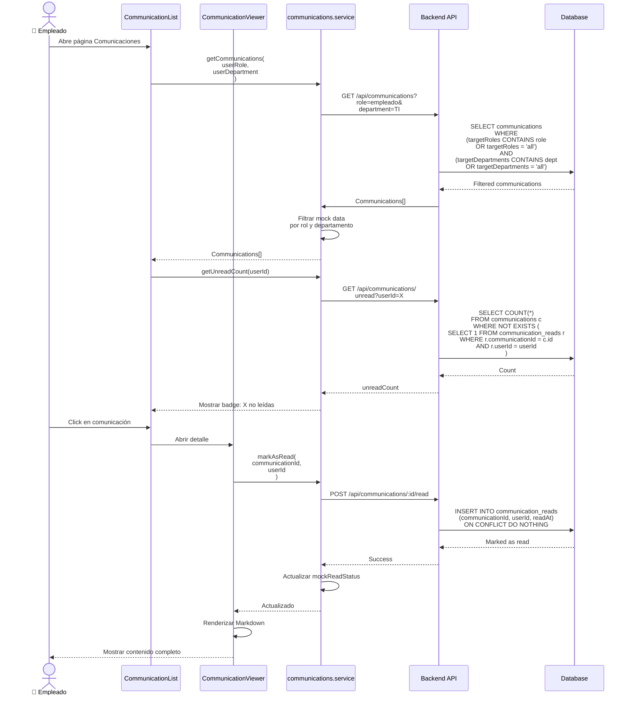

## 7. Sistema de Estado de Lectura

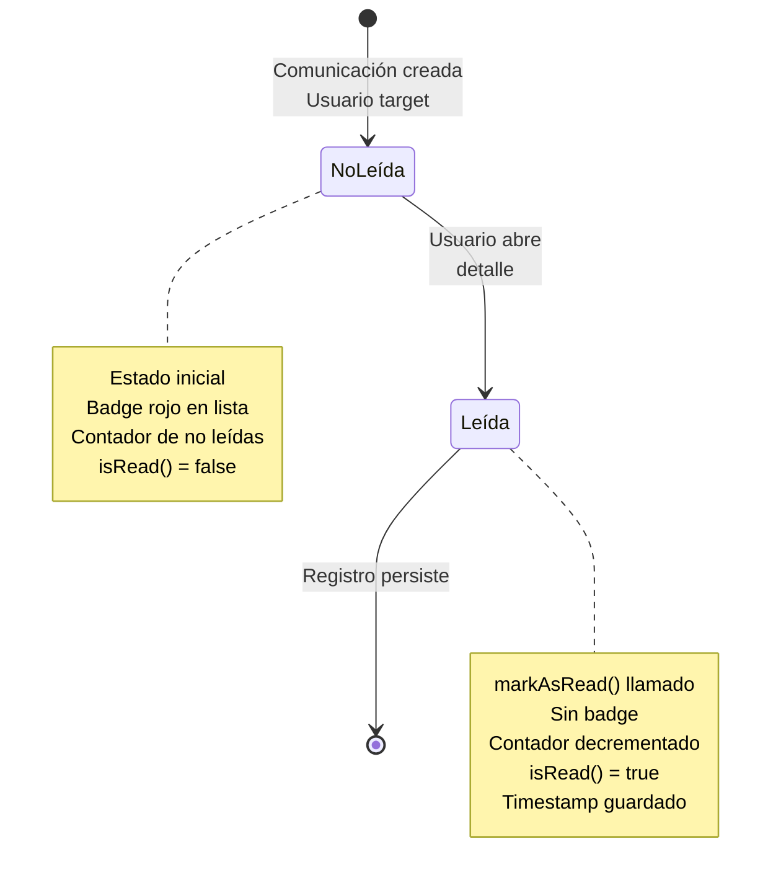

## 8. Búsqueda y Filtrado

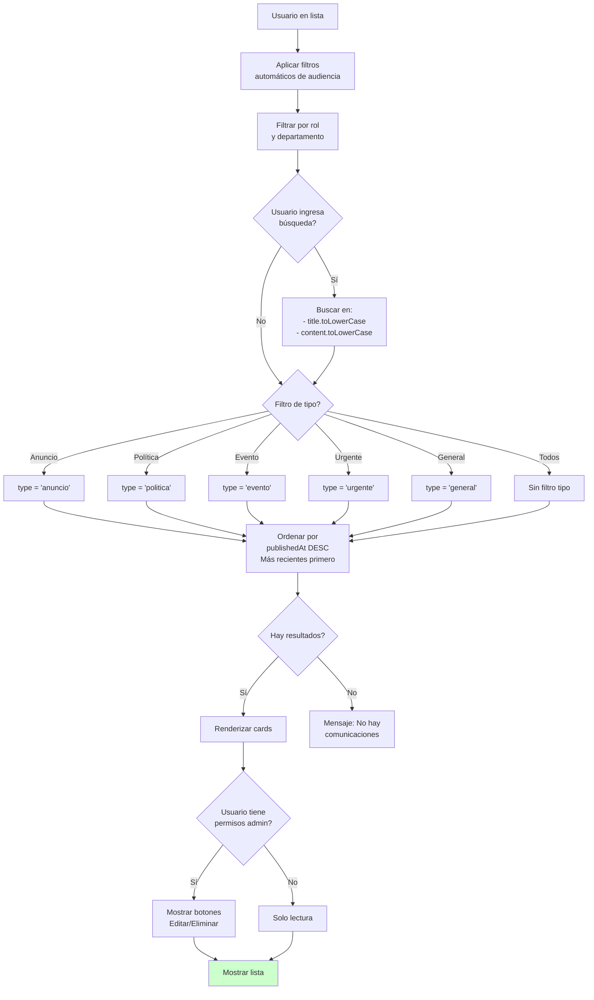

## 9. Modelo de Datos Necesario

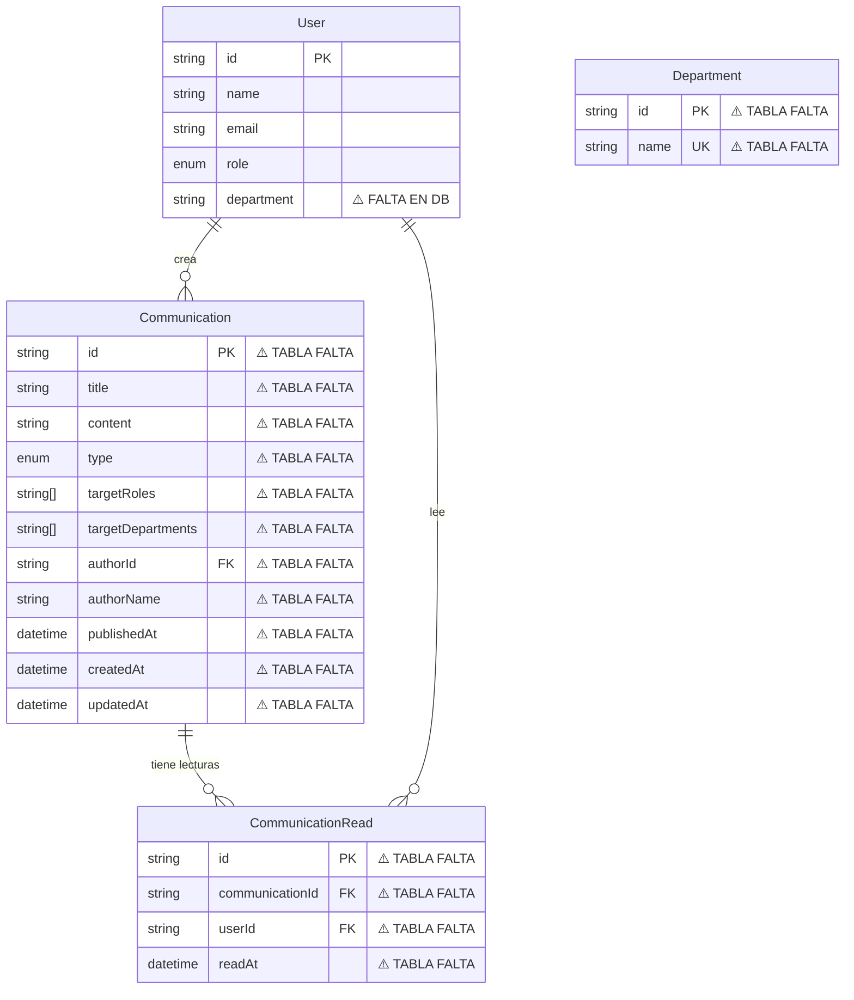

## 10. Integración con Dashboard

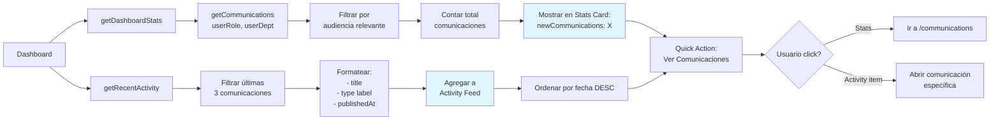

## 11. Permisos por Rol

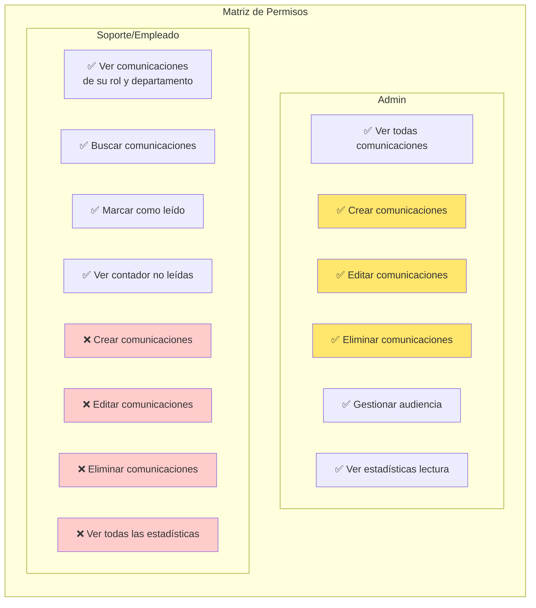

## 12. Renderizado de Markdown

```mermaid
flowchart TD
    A[Comunicación con<br/>contenido Markdown] --> B[CommunicationViewer]

    B --> C[ReactMarkdown<br/>component]

    C --> D{Elementos soportados}

    D --> E[# Headings<br/>h1, h2, h3]
    D --> F[**Bold** *Italic*<br/><u>Underline</u>]
    D --> G[- Bullet lists<br/>1. Numbered lists]
    D --> H[```code blocks```]
    D --> I[[Links] Externos]

    E --> J[Render con estilos<br/>personalizados]
    F --> J
    G --> J
    H --> J
    I --> J

    J --> K[Aplicar clases prose<br/>Tailwind]

    K --> L[HTML final renderizado]

    L --> M{Tipo comunicación}

    M -->|Urgente| N[Destacar con borde<br/>y fondo rojo]
    M -->|Evento| O[Destacar con borde<br/>y fondo verde]
    M -->|Otros| P[Estilo normal]

    N --> Q[Mostrar al usuario]
    O --> Q
    P --> Q

    style Q fill:#ccffcc
```

## 13. Audiencia y Targeting

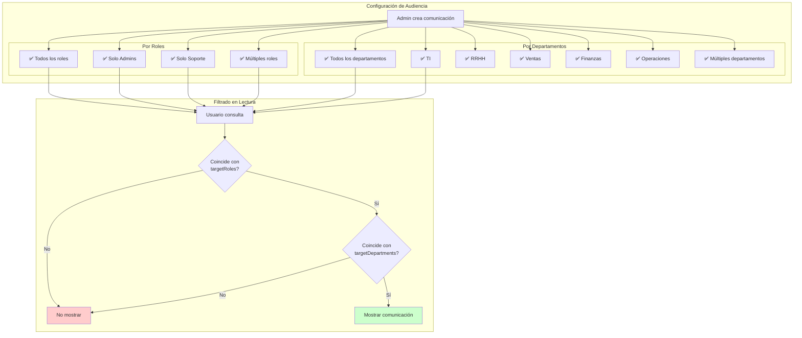

## Resumen Técnico

### Estado Actual
- ✅ **Frontend**: 100% funcional con mock data
- ✅ **Markdown**: Renderizado completo
- ✅ **Tipos**: 5 tipos de comunicaciones
- ✅ **Audiencia**: Filtrado por roles y departamentos
- ✅ **Estado lectura**: Sistema de tracking
- ⚠️ **Backend**: NO implementado
- ⚠️ **Database**: Sin tablas

### Datos Mock (5 comunicaciones)
```typescript
mockCommunications: [
  {
    id: "1",
    title: "Nueva política de trabajo remoto",
    type: "politica",
    targetRoles: "all",
    targetDepartments: "all",
    publishedAt: "2024-01-15"
  },
  {
    id: "2",
    title: "Actualización crítica de seguridad",
    type: "urgente",
    targetRoles: ["empleado"],
    targetDepartments: ["TI"],
    publishedAt: "2024-01-10"
  },
  // ... 3 más
]
```

### Tablas Necesarias en DB
1. ❌ `Communication` - Tabla principal
2. ❌ `CommunicationRead` - Estado de lectura
3. ❌ `Department` - Catálogo de departamentos
4. ❌ Campo `department` en tabla `User`

### Endpoints Necesarios
- `GET /api/communications` - Listar filtradas por audiencia
- `GET /api/communications/:id` - Detalle
- `POST /api/communications` - Crear (ADMIN)
- `PATCH /api/communications/:id` - Editar (ADMIN)
- `DELETE /api/communications/:id` - Eliminar (ADMIN)
- `POST /api/communications/:id/read` - Marcar como leída
- `GET /api/communications/unread` - Contador no leídas

### Stack Tecnológico
- **Frontend**: Next.js 14, TypeScript
- **Markdown**: ReactMarkdown
- **UI**: shadcn/ui, Tailwind CSS
- **Backend Pendiente**: NestJS, Prisma
- **Database**: PostgreSQL

### Características Clave
1. ✅ 5 tipos de comunicaciones con colores
2. ✅ Targeting por roles y departamentos
3. ✅ Sistema de lectura con tracking
4. ✅ Contador de no leídas
5. ✅ Búsqueda full-text
6. ✅ Filtros por tipo
7. ✅ Markdown completo
8. ✅ Integración con dashboard
9. ✅ Permisos ADMIN para gestión
10. ✅ UI responsiva y moderna
