# Diagramas de Flujo - Módulo de Base de Conocimientos

## 1. Diagrama de Casos de Uso

```mermaid
graph TB
    Admin[👑 Administrador]
    Support[👨‍💻 Soporte]
    User[👤 Usuario]

    subgraph "Base de Conocimientos"
        direction TB

        subgraph "Consulta Pública"
            UC1[Buscar Artículos]
            UC2[Explorar por Categoría]
            UC3[Ver Artículo]
            UC4[Valorar Artículo<br/>Útil/No útil]
            UC5[Ver Artículos Relacionados]
        end

        subgraph "Gestión ADMIN"
            UC6[Crear Artículo]
            UC7[Editar Artículo]
            UC8[Publicar/Despublicar]
            UC9[Archivar Artículo]
            UC10[Gestionar Tags]
            UC11[Ver Estadísticas]
            UC12[Ver Todos los Estados]
        end
    end

    User --> UC1
    User --> UC2
    User --> UC3
    User --> UC4
    User --> UC5

    Support --> UC1
    Support --> UC2
    Support --> UC3
    Support --> UC4
    Support --> UC5

    Admin --> UC1
    Admin --> UC2
    Admin --> UC3
    Admin --> UC4
    Admin --> UC5
    Admin --> UC6
    Admin --> UC7
    Admin --> UC8
    Admin --> UC9
    Admin --> UC10
    Admin --> UC11
    Admin --> UC12

    style User fill:#a8dadc
    style Support fill:#457b9d
    style Admin fill:#e63946
    style UC6 fill:#ffe66d
    style UC7 fill:#ffe66d
    style UC8 fill:#ffe66d
```

## 2. Flujo de Creación de Artículo

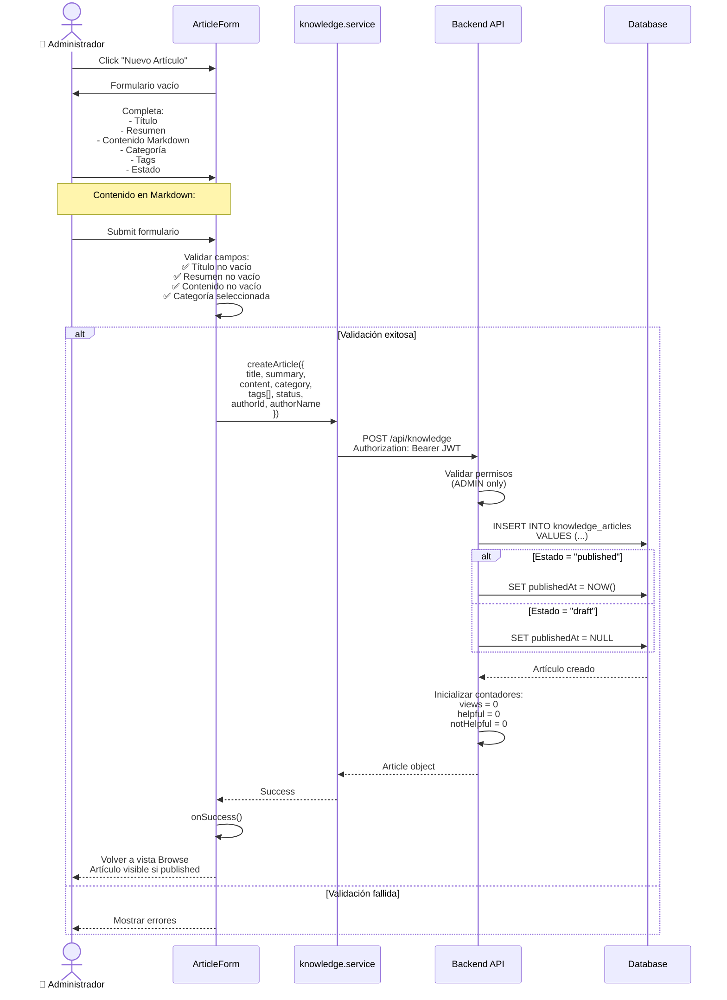

## 3. Estados del Artículo

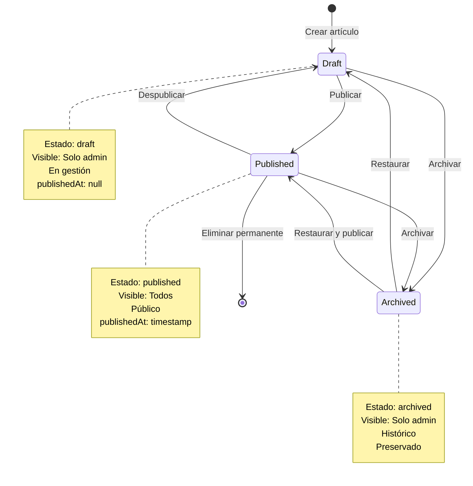

## 4. Arquitectura del Módulo

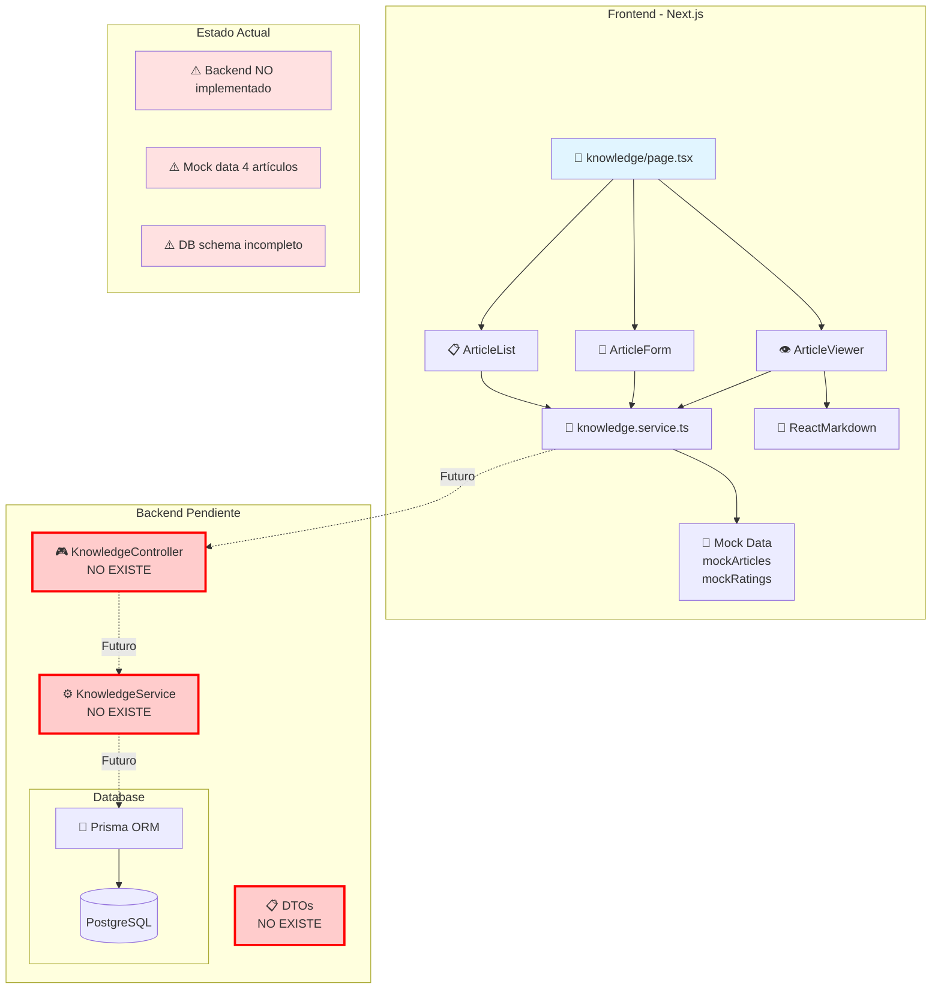

## 5. Sistema de Categorías

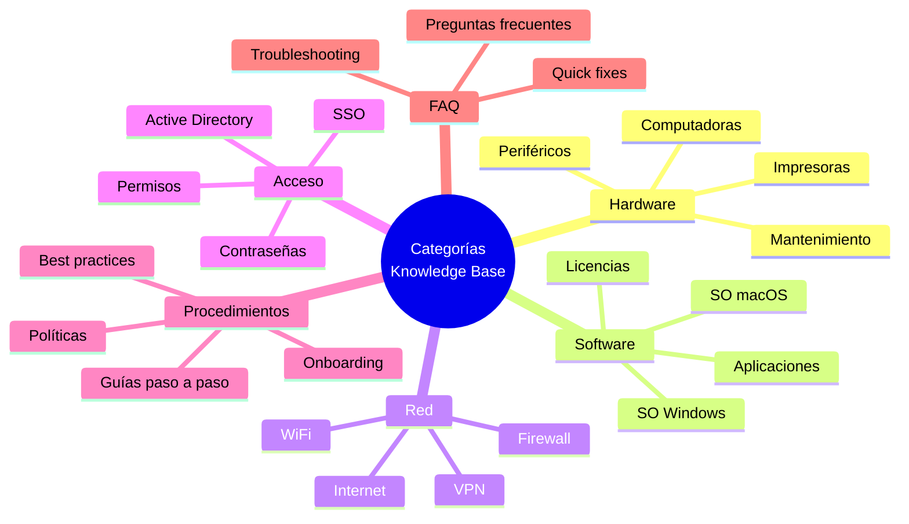

## 6. Flujo de Búsqueda y Filtrado

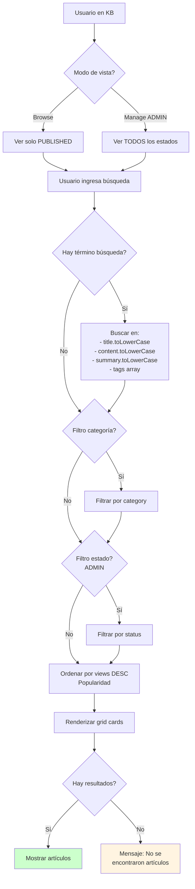

## 7. Sistema de Valoración

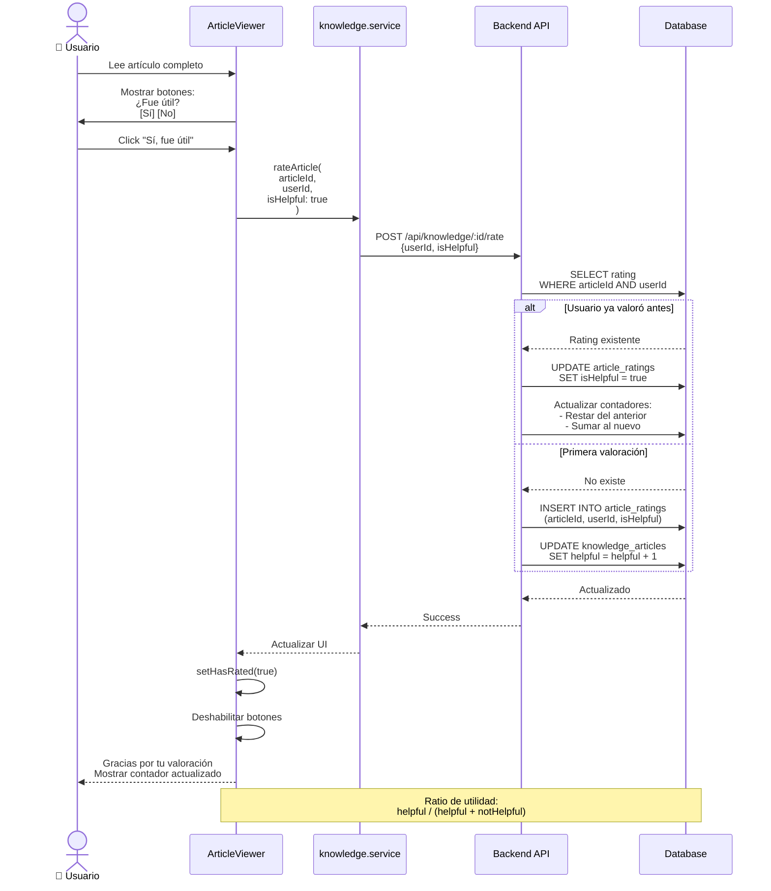

## 8. Modelo de Datos (Actual vs Necesario)

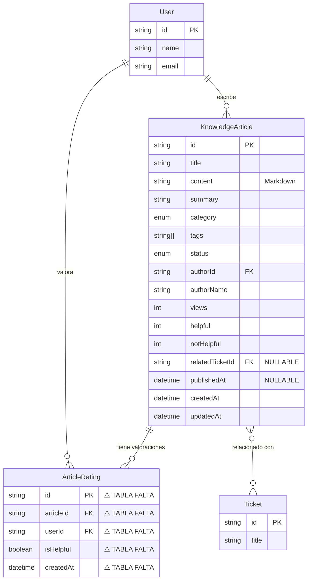

## 9. Renderizado de Markdown

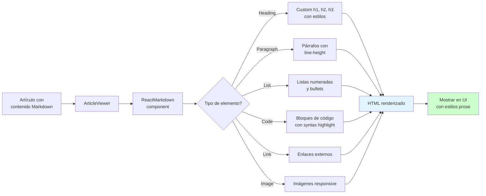

## 10. Incremento de Vistas

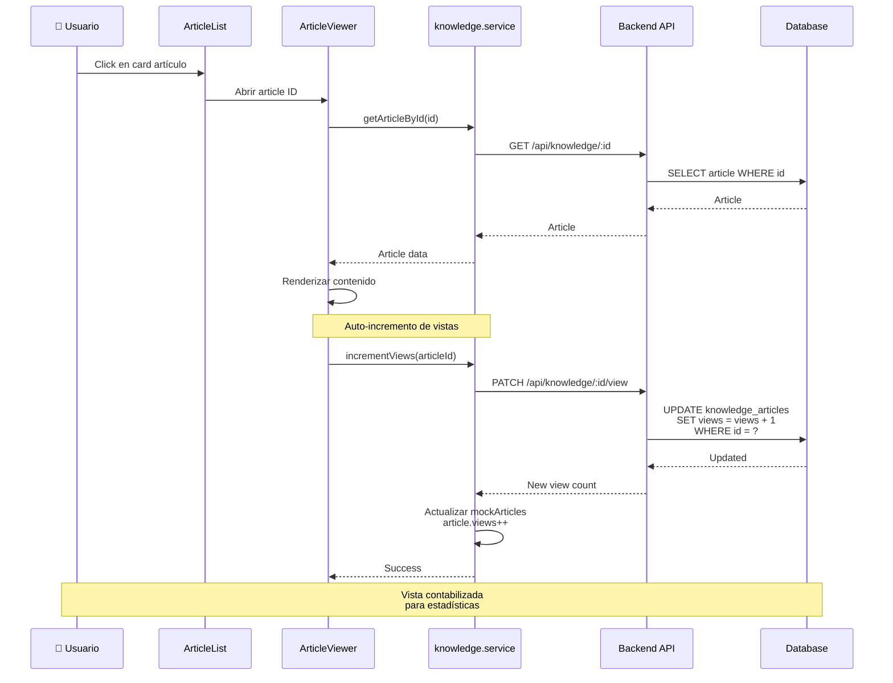

## 11. Artículos Relacionados

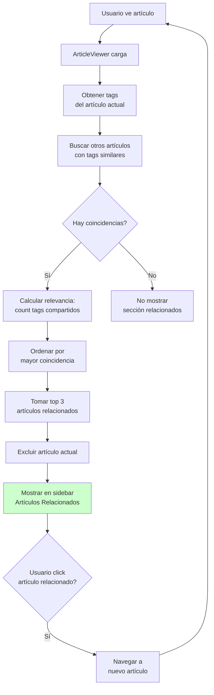

## 12. Integración con Dashboard

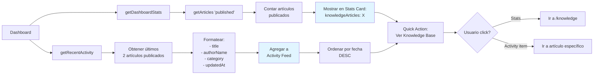

## 13. Gestión de Tags

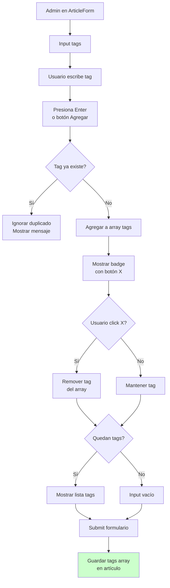

## Resumen Técnico

### Estado Actual
- ✅ **Frontend**: 100% funcional con mock data
- ✅ **Markdown**: Renderizado completo con ReactMarkdown
- ✅ **Búsqueda**: Full-text search cliente
- ✅ **Valoración**: Sistema helpful/not helpful
- ✅ **Tags**: Gestión dinámica
- ⚠️ **Backend**: NO implementado
- ⚠️ **Database**: Schema básico incompleto

### Datos Mock (4 artículos)
```typescript
mockArticles: [
  {
    id: "1",
    title: "Cómo reiniciar el router de la oficina",
    category: "red",
    tags: ["router", "internet", "conectividad"],
    status: "published",
    views: 45,
    helpful: 12,
    notHelpful: 1
  },
  {
    id: "2",
    title: "Configuración de correo en Outlook",
    category: "software",
    tags: ["outlook", "correo", "email"],
    status: "published",
    views: 78,
    helpful: 25,
    notHelpful: 3
  },
  // ... 2 más
]
```

### Campos Faltantes en DB
1. ❌ `summary` (text)
2. ❌ `category` (enum)
3. ❌ `status` (enum)
4. ❌ `authorId` + `authorName` (FK + string)
5. ❌ `publishedAt` (timestamp nullable)
6. ❌ `views`, `helpful`, `notHelpful` (integers)
7. ❌ `relatedTicketId` (FK nullable)
8. ❌ Tabla `ArticleRating` completa

### Endpoints Necesarios
- `GET /api/knowledge` - Listar artículos con filtros
- `GET /api/knowledge/:id` - Detalle de artículo
- `POST /api/knowledge` - Crear (ADMIN)
- `PATCH /api/knowledge/:id` - Actualizar (ADMIN)
- `DELETE /api/knowledge/:id` - Eliminar (ADMIN)
- `PATCH /api/knowledge/:id/view` - Incrementar vistas
- `POST /api/knowledge/:id/rate` - Valorar artículo

### Stack Tecnológico
- **Frontend**: Next.js 14, TypeScript
- **Markdown**: ReactMarkdown
- **UI**: shadcn/ui, Tailwind CSS
- **Backend Pendiente**: NestJS, Prisma
- **Database**: PostgreSQL

### Características Clave
1. ✅ Markdown completo con syntax highlighting
2. ✅ Sistema de valoración (helpful ratio)
3. ✅ Búsqueda full-text
4. ✅ Categorización y tags
5. ✅ Estados (draft/published/archived)
6. ✅ Artículos relacionados por tags
7. ✅ Contador de vistas
8. ✅ Integración con dashboard
