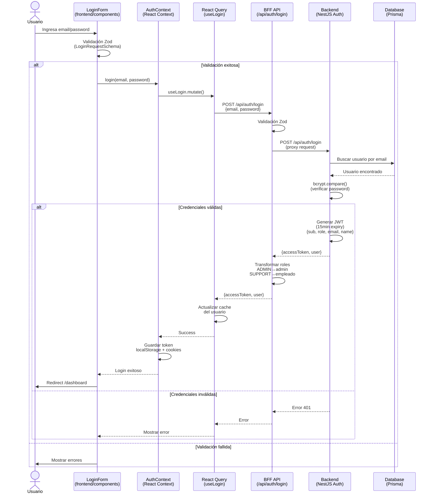
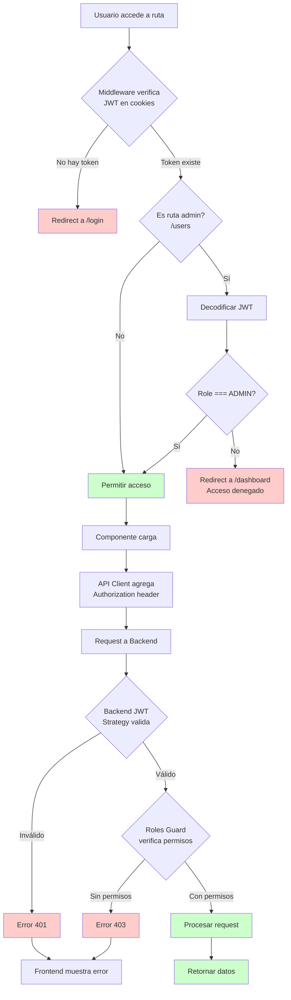
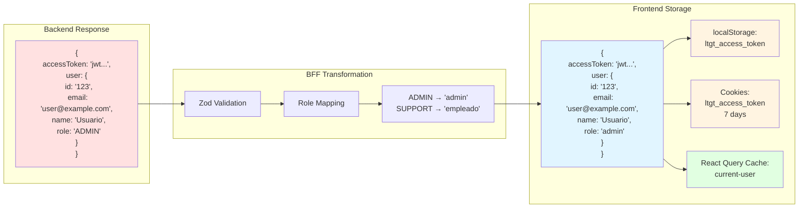
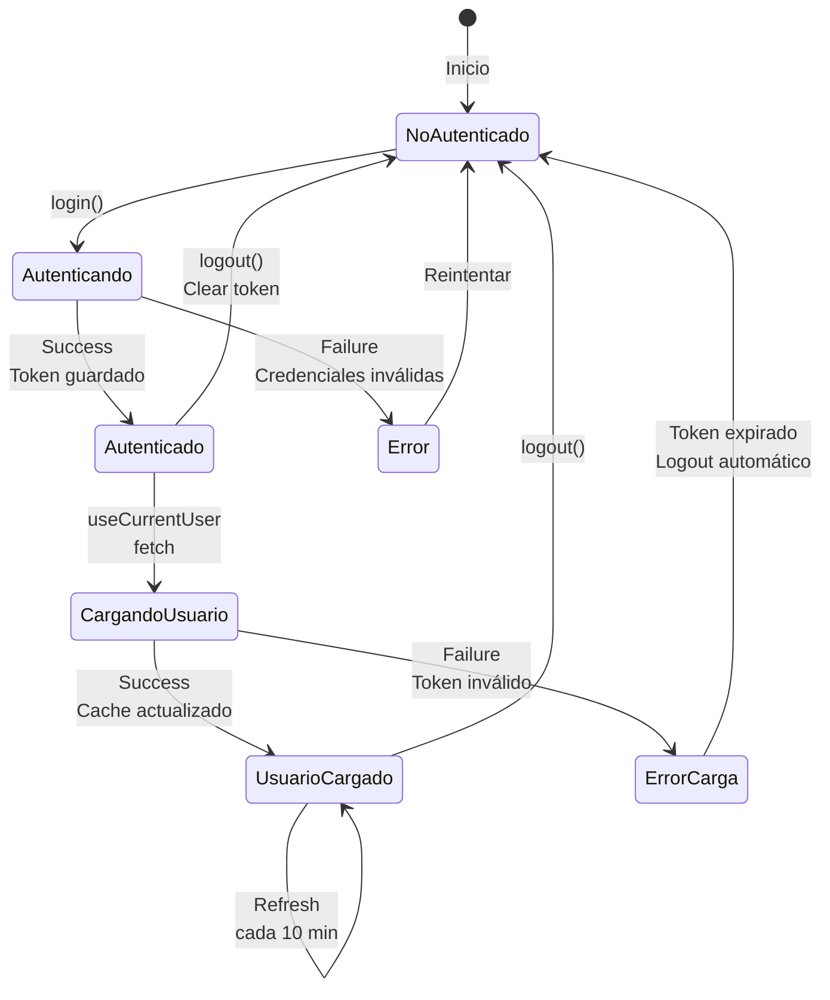
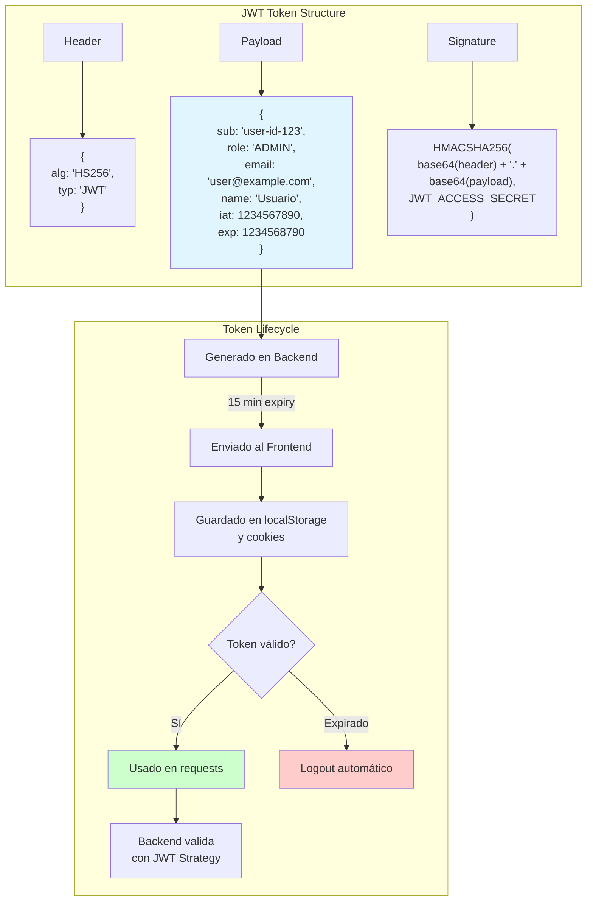
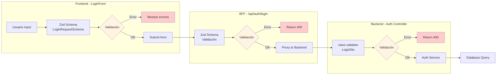

# Diagramas de Flujo - Sistema de Autenticación

Este documento contiene diagramas Mermaid que visualizan el flujo de autenticación del sistema LTGT.

## 1. Flujo Completo de Login (Secuencia)



## 2. Arquitectura de Componentes

```mermaid
graph TB
    subgraph "Frontend - Next.js"
        A[LoginForm Component] -->|useAuth| B[AuthContext]
        B -->|hooks| C[React Query]
        C -->|useLogin| D[Auth Queries]
        C -->|useCurrentUser| D
        D -->|API calls| E[Auth Service]
        E -->|HTTP| F[API Client]
        F -->|JWT interceptor| F

        G[Middleware] -->|verifica JWT| H[Cookies]
        G -->|protege rutas| I[Protected Routes]

        J[page.tsx] -->|renderiza| A
    end

    subgraph "BFF - Next.js API Routes"
        K[/api/auth/login] -->|proxy| N
        L[/api/auth/me] -->|proxy| N
        M[/api/auth/logout] -->|clear token| N
        N[API Backend Service]
    end

    subgraph "Backend - NestJS"
        O[Auth Controller] -->|usa| P[Auth Service]
        P -->|bcrypt| Q[Password Hashing]
        P -->|genera| R[JWT Service]
        P -->|consulta| S[(Prisma DB)]

        T[JWT Strategy] -->|valida| R
        U[JWT Guard] -->|protege| O
        V[Roles Guard] -->|RBAC| O
    end

    F -->|HTTP| K
    F -->|HTTP| L
    N -->|HTTP| O

    style A fill:#e1f5ff
    style B fill:#e1f5ff
    style O fill:#ffe1e1
    style P fill:#ffe1e1
    style S fill:#f0f0f0
```

## 3. Flujo de Protección de Rutas



## 4. Transformación de Datos (Login Response)



## 5. Estados de Autenticación (React Query)



## 6. Estructura de JWT



## 7. Validación de Schemas (Zod)



## 8. Gestión de Permisos (RBAC)

```mermaid
graph TB
    subgraph "Definición de Roles"
        A[Backend Roles] --> B["ADMIN<br/>SUPPORT"]
        C[Frontend Roles] --> D["admin<br/>empleado"]
    end

    subgraph "Middleware Protection"
        E[Public Routes] --> F[/, /login]
        G[Protected Routes] --> H[/dashboard<br/>/products<br/>/tickets<br/>/knowledge<br/>/communications]
        I[Admin Only Routes] --> J[/users]
    end

    subgraph "Backend Guards"
        K[@Roles Decorator] --> L[Roles Guard]
        L --> M{User role<br/>in required roles?}
        M -->|No| N[403 Forbidden]
        M -->|Yes| O[Allow access]
    end

    subgraph "Frontend Permissions"
        P[hasPermission] --> Q{Check role}
        Q -->|admin| R[Full access]
        Q -->|empleado| S[Limited access]
    end

    B --> D
    D --> Q
    J --> K

    style N fill:#ffcccc
    style O fill:#ccffcc
    style R fill:#ccffcc
```

## Resumen de Tecnologías

- **Frontend**: Next.js 14, React Query, Zod, TypeScript
- **BFF**: Next.js API Routes (Proxy pattern)
- **Backend**: NestJS, Passport JWT, bcrypt
- **Database**: PostgreSQL + Prisma ORM
- **Authentication**: JWT (15 min expiry)
- **Storage**: localStorage + cookies (7 days)
- **Validation**: Zod (frontend/BFF), class-validator (backend)
- **State Management**: React Query (no Redux)

## Características de Seguridad

1. ✅ Passwords hasheados con bcrypt
2. ✅ JWT con expiración (15 minutos)
3. ✅ Validación en múltiples capas (Frontend, BFF, Backend)
4. ✅ RBAC (Role-Based Access Control)
5. ✅ Middleware para protección de rutas
6. ✅ Guards de autenticación y autorización
7. ✅ Type safety con TypeScript + Zod
8. ✅ BFF pattern para separación de concerns
