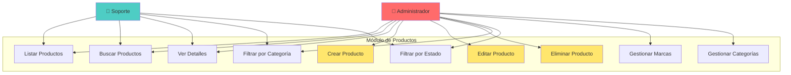
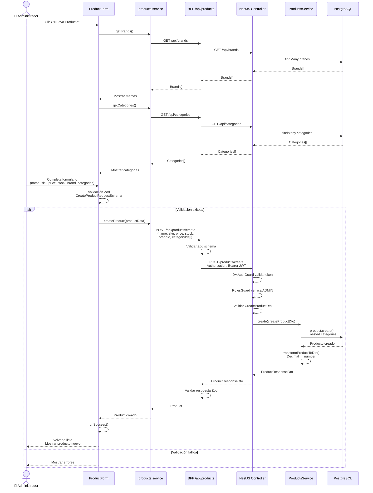
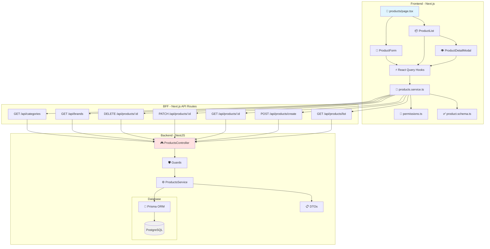
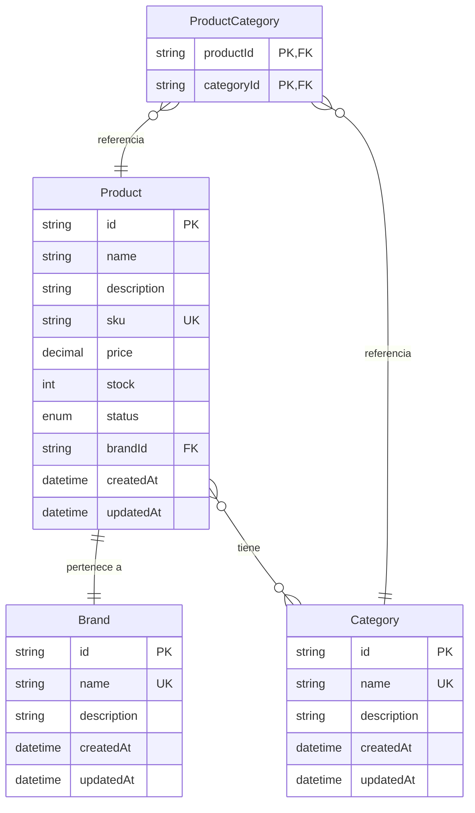
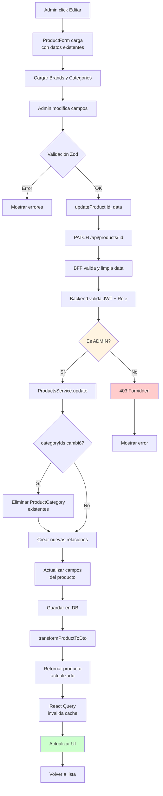
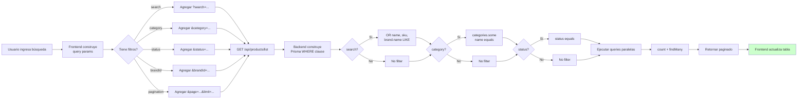
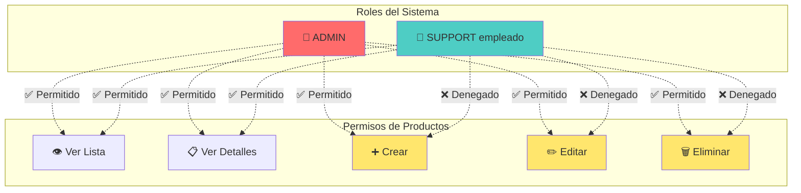
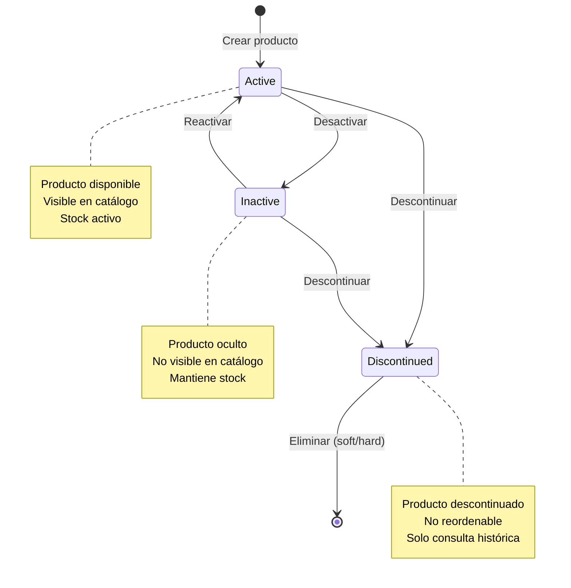
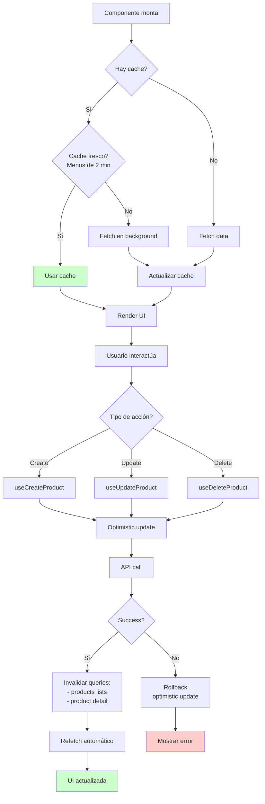

# Diagramas de Flujo - Módulo de Productos

## 1. Diagrama de Casos de Uso

## 2. Flujo Completo de Creación de Producto

## 3. Arquitectura del Módulo de Productos

## 4. Modelo de Datos

## 5. Flujo de Actualización de Producto

## 6. Sistema de Filtros y Búsqueda

## 7. Permisos por Rol

## 8. Estados de Producto

## 9. Gestión de Cache (React Query)

## Resumen Técnico

### Stack Tecnológico
- **Frontend**: Next.js 14, React Query, Zod, TypeScript
- **BFF**: Next.js API Routes
- **Backend**: NestJS, Prisma ORM
- **Database**: PostgreSQL
- **Auth**: JWT (15 min expiry)

### Características Clave
1. ✅ CRUD completo con validación en 3 capas
2. ✅ Relaciones Many-to-One (Brand) y Many-to-Many (Categories)
3. ✅ Sistema de permisos basado en roles
4. ✅ Búsqueda y filtros avanzados
5. ✅ Paginación server-side
6. ✅ Cache inteligente con React Query
7. ✅ Índices de base de datos para performance
8. ✅ Transformación de tipos (Decimal → number)

### Endpoints Backend
- `GET /api/products/list` - Lista paginada con filtros
- `GET /api/products/detail/:id` - Detalle de producto
- `POST /api/products/create` - Crear (ADMIN)
- `PATCH /api/products/update/:id` - Actualizar (ADMIN)
- `DELETE /api/products/delete/:id` - Eliminar (ADMIN)
- `GET /api/brands` - Lista de marcas
- `GET /api/categories` - Lista de categorías
