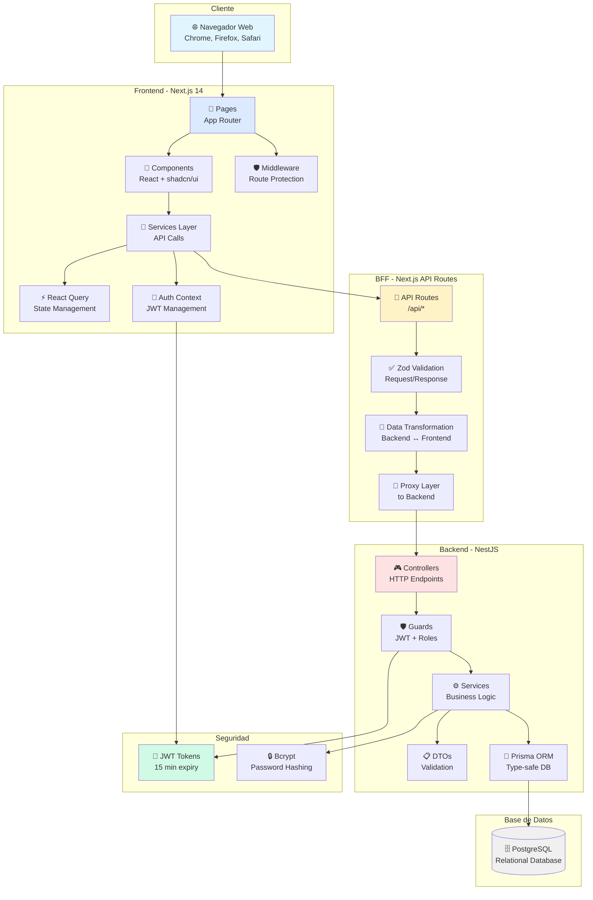
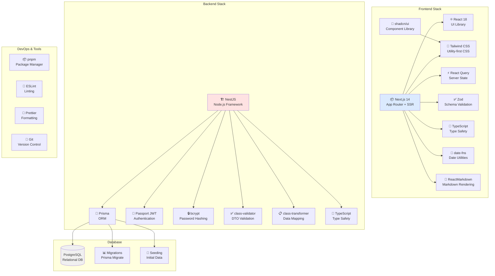
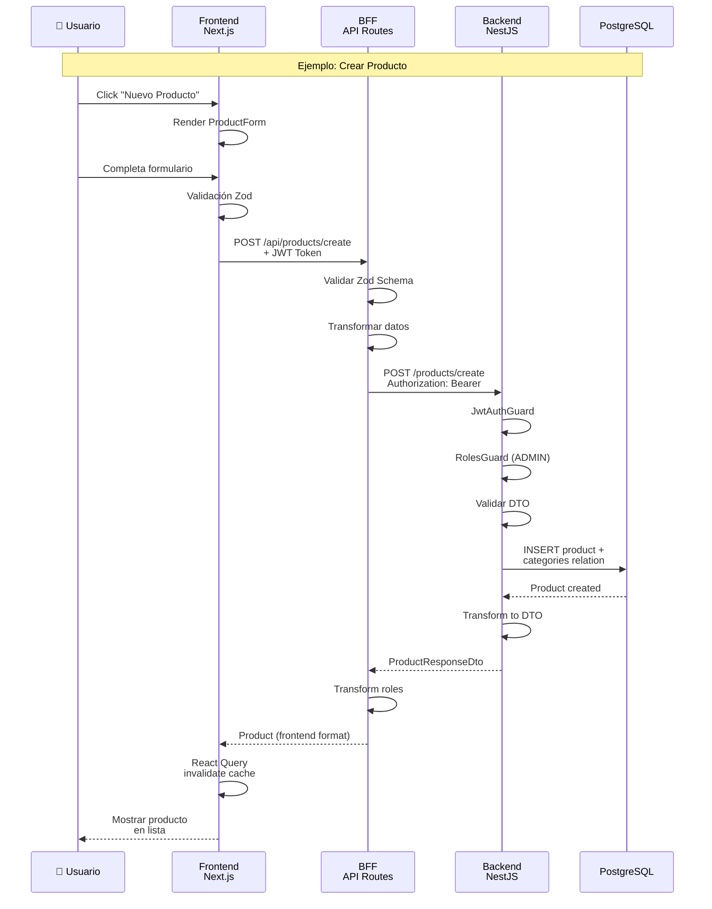
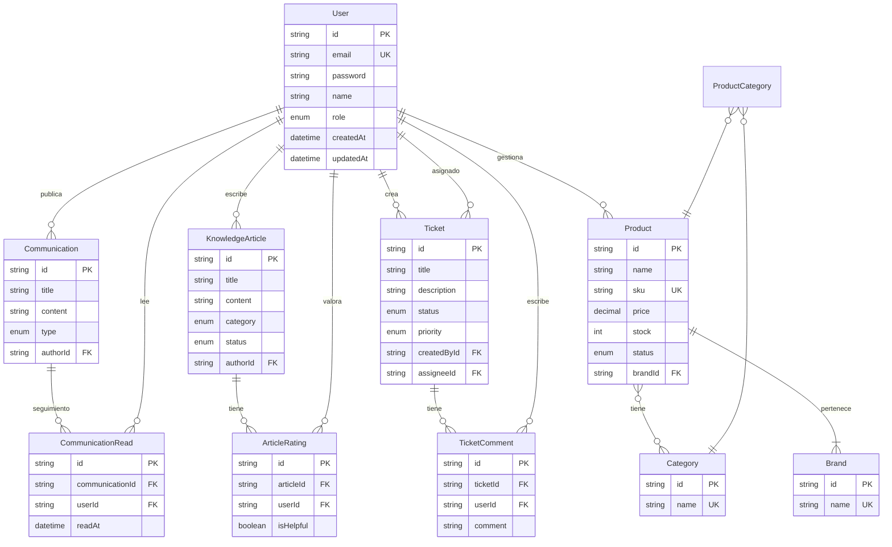
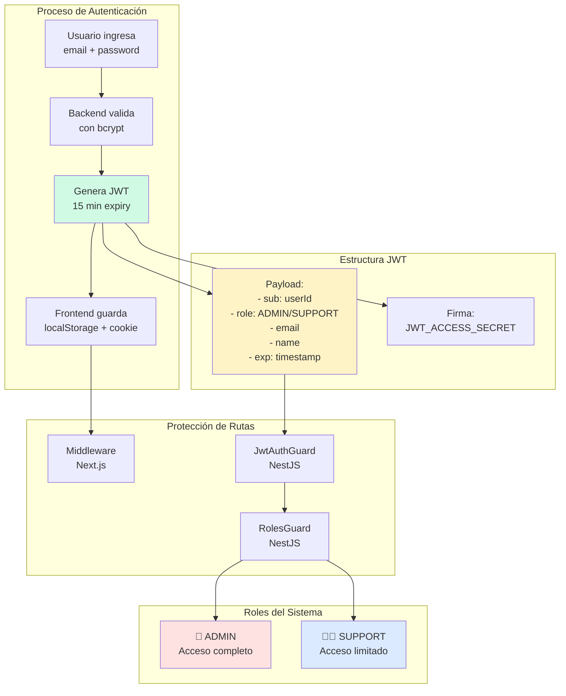
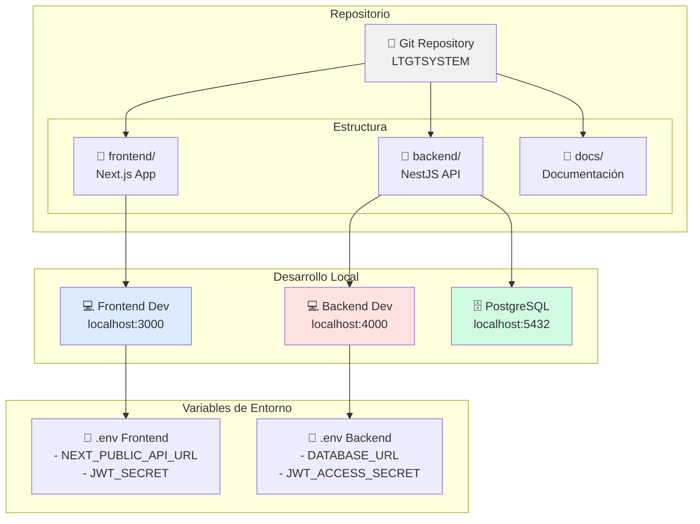
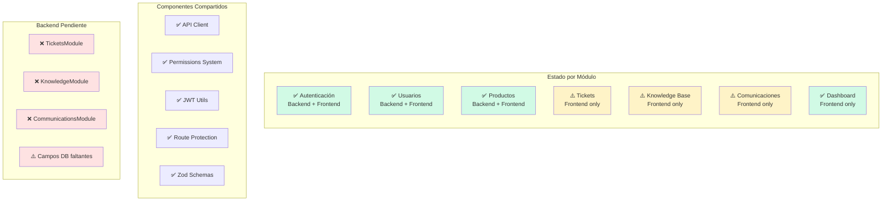

# Arquitectura del Sistema LTGTSYSTEM

## 1. Arquitectura General de Capas



## 2. Arquitectura por Módulos

```mermaid
graph LR
    subgraph "Frontend Next.js"
        subgraph "Módulos Implementados"
            M1[👤 Usuarios<br/>CRUD completo]
            M2[📦 Productos<br/>CRUD + Categorías]
            M3[🎫 Tickets<br/>Soporte técnico]
            M4[📚 Knowledge Base<br/>Artículos]
            M5[📢 Comunicaciones<br/>Anuncios]
            M6[📊 Dashboard<br/>Estadísticas]
        end

        Common[🔧 Shared<br/>- API Client<br/>- Permissions<br/>- JWT Utils]
    end

    subgraph "BFF Next.js API"
        BFF1[/api/users]
        BFF2[/api/products]
        BFF3[/api/tickets]
        BFF4[/api/knowledge]
        BFF5[/api/communications]
        BFF6[/api/auth]
    end

    subgraph "Backend NestJS"
        subgraph "Módulos Backend"
            BE1[UsersModule ✅]
            BE2[ProductsModule ✅]
            BE3[AuthModule ✅]
            BE4[TicketsModule ❌]
            BE5[KnowledgeModule ❌]
            BE6[CommunicationsModule ❌]
        end
    end

    M1 --> BFF1
    M2 --> BFF2
    M3 --> BFF3
    M4 --> BFF4
    M5 --> BFF5
    M1 --> BFF6
    M6 --> BFF1
    M6 --> BFF2
    M6 --> BFF3

    BFF1 --> BE1
    BFF2 --> BE2
    BFF6 --> BE3
    BFF3 -.->|Pendiente| BE4
    BFF4 -.->|Pendiente| BE5
    BFF5 -.->|Pendiente| BE6

    M1 --> Common
    M2 --> Common
    M3 --> Common
    M4 --> Common
    M5 --> Common

    style M1 fill:#d1fae5
    style M2 fill:#d1fae5
    style BE1 fill:#d1fae5
    style BE2 fill:#d1fae5
    style BE3 fill:#d1fae5
    style BE4 fill:#fee2e2
    style BE5 fill:#fee2e2
    style BE6 fill:#fee2e2
```

## 3. Stack Tecnológico Completo



## 4. Flujo de Datos Completo



## 5. Modelo de Datos Global



## 6. Sistema de Autenticación y Autorización



## 7. Infraestructura de Desarrollo



## 8. Matriz de Estado de Implementación



## 9. Flujo de Petición HTTP Completo

```mermaid
flowchart LR
    A[👤 Usuario] --> B[React Component]
    B --> C{Autenticado?}

    C -->|No| D[Redirect /login]
    C -->|Sí| E[API Service]

    E --> F[API Client]
    F --> G[Agregar JWT Header]
    G --> H[Llamada HTTP]

    H --> I[Next.js Middleware]
    I --> J{Token válido?}
    J -->|No| K[401 Redirect]
    J -->|Sí| L[BFF API Route]

    L --> M[Validar Zod]
    M --> N[Transformar datos]
    N --> O[Proxy a Backend]

    O --> P[NestJS Controller]
    P --> Q[JwtAuthGuard]
    Q --> R{JWT válido?}
    R -->|No| S[401 Unauthorized]
    R -->|Sí| T[RolesGuard]

    T --> U{Role permitido?}
    U -->|No| V[403 Forbidden]
    U -->|Sí| W[Service]

    W --> X[Prisma Query]
    X --> Y[(PostgreSQL)]
    Y --> Z[Response]

    Z --> AA[Transform DTO]
    AA --> AB[BFF Transform]
    AB --> AC[React Query Cache]
    AC --> AD[UI Update]

    style A fill:#e1f5ff
    style Y fill:#f0f0f0
    style AD fill:#d1fae5
    style K fill:#fee2e2
    style S fill:#fee2e2
    style V fill:#fee2e2
```



## Resumen de Arquitectura

### 🏗️ Patrón de Arquitectura
**BFF (Backend for Frontend)** con separación clara de responsabilidades:
- **Frontend**: UI/UX y estado cliente
- **BFF**: Transformación de datos y proxy
- **Backend**: Lógica de negocio y persistencia

### 🔑 Características Clave

1. **Type Safety End-to-End**
   - TypeScript en Frontend y Backend
   - Zod para validación runtime
   - Prisma para type-safe queries

2. **Seguridad Multi-Capa**
   - JWT con expiración corta (15 min)
   - Bcrypt para passwords (10 rounds)
   - Guards en múltiples niveles
   - RBAC completo

3. **Estado del Cliente**
   - React Query para server state
   - Cache inteligente
   - Optimistic updates
   - Automatic refetching

4. **Validación Triple**
   - Frontend: Formularios
   - BFF: Zod schemas
   - Backend: DTOs + class-validator

### 📊 Métricas del Sistema

- **Líneas de código Frontend**: ~15,000+
- **Líneas de código Backend**: ~5,000+
- **Componentes React**: 30+
- **API Endpoints**: 25+
- **Tablas DB**: 8+ (algunas pendientes)
- **Roles**: 2 (ADMIN, SUPPORT)
- **Módulos**: 6 principales

### 🚀 Stack Resumido

| Capa | Tecnología Principal |
|------|---------------------|
| Frontend | Next.js 14 + React 18 + TypeScript |
| BFF | Next.js API Routes + Zod |
| Backend | NestJS + Prisma + Passport |
| Database | PostgreSQL |
| UI | Tailwind CSS + shadcn/ui |
| State | React Query |
| Auth | JWT + bcrypt |

### ✅ Completado vs ⚠️ Pendiente

**Completado (Backend + Frontend):**
- ✅ Sistema de autenticación
- ✅ Gestión de usuarios
- ✅ Gestión de productos (con marcas y categorías)
- ✅ Dashboard con estadísticas

**Frontend Completo (Backend Pendiente):**
- ⚠️ Sistema de tickets
- ⚠️ Base de conocimientos
- ⚠️ Comunicaciones internas

### 🎯 Próximos Pasos Recomendados

1. Implementar backend de Tickets
2. Implementar backend de Knowledge Base
3. Implementar backend de Comunicaciones
4. Agregar tabla Department
5. Completar campos faltantes en DB
6. Sistema de notificaciones
7. Recuperación de contraseña
8. Logs y auditoría
