# Diagramas de Flujo - Módulo de Tickets (Soporte Técnico)

## 1. Diagrama de Casos de Uso

```mermaid
graph TB
    User[👤 Usuario]
    Support[👨‍💻 Soporte/Empleado]
    Admin[👑 Administrador]

    subgraph "Módulo de Soporte Técnico"
        UC1[Crear Ticket]
        UC2[Ver Mis Tickets]
        UC3[Ver Detalle Ticket]
        UC4[Agregar Comentarios]
        UC5[Buscar Tickets]
        UC6[Filtrar por Estado]
        UC7[Filtrar por Prioridad]

        UC8[Ver Todos los Tickets]
        UC9[Asignarse Ticket]
        UC10[Actualizar Estado]
        UC11[Marcar como Resuelto]
        UC12[Agregar Solución]
        UC13[Filtrar por Asignación]
        UC14[Cerrar Ticket]

        UC15[Eliminar Ticket]
        UC16[Reasignar Ticket]
    end

    User --> UC1
    User --> UC2
    User --> UC3
    User --> UC4
    User --> UC5
    User --> UC6
    User --> UC7

    Support --> UC1
    Support --> UC2
    Support --> UC3
    Support --> UC4
    Support --> UC8
    Support --> UC9
    Support --> UC10
    Support --> UC11
    Support --> UC12
    Support --> UC13
    Support --> UC14

    Admin --> UC1
    Admin --> UC2
    Admin --> UC3
    Admin --> UC4
    Admin --> UC8
    Admin --> UC9
    Admin --> UC10
    Admin --> UC11
    Admin --> UC12
    Admin --> UC13
    Admin --> UC14
    Admin --> UC15
    Admin --> UC16

    style User fill:#a8dadc
    style Support fill:#457b9d
    style Admin fill:#e63946
    style UC9 fill:#ffe66d
    style UC10 fill:#ffe66d
    style UC11 fill:#ffe66d
    style UC15 fill:#ff6b6b
```

## 2. Ciclo de Vida Completo de un Ticket

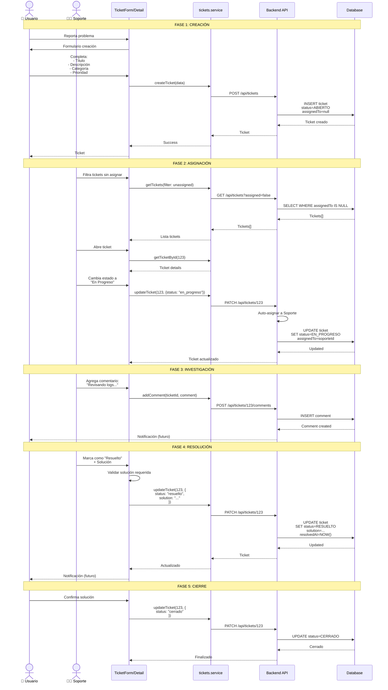

## 3. Diagrama de Estados del Ticket

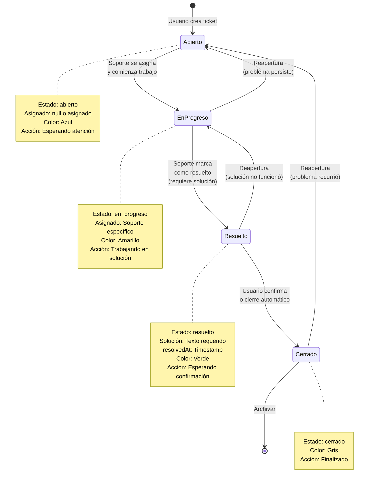

## 4. Arquitectura del Módulo de Tickets

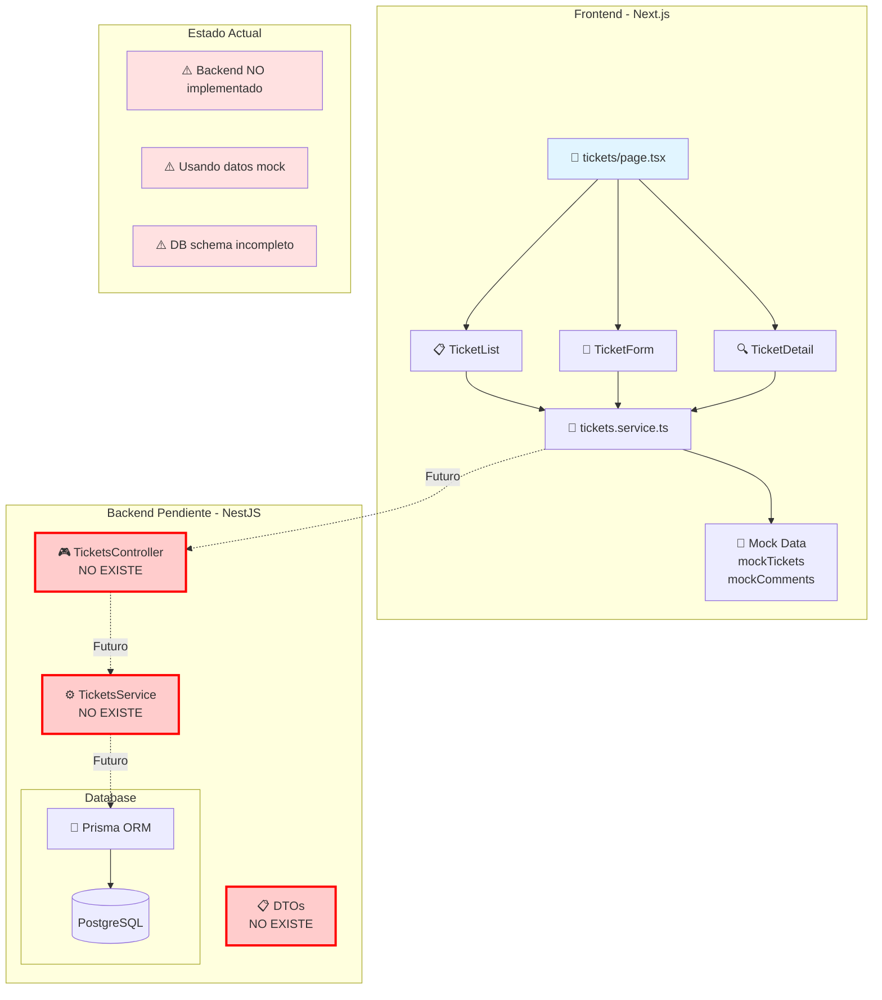

## 5. Sistema de Prioridades

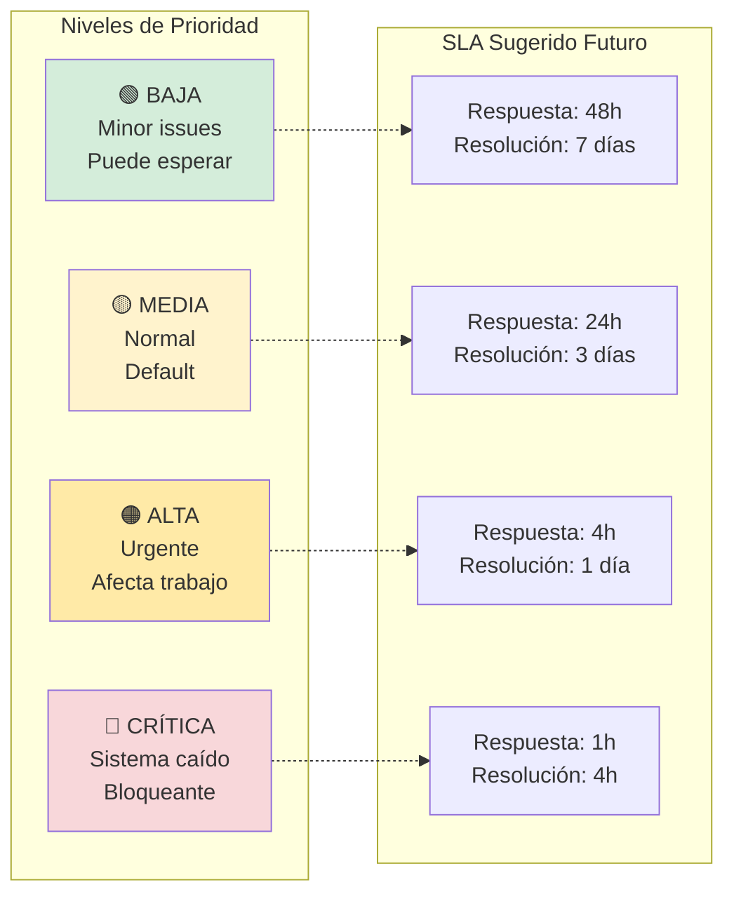

## 6. Sistema de Categorías

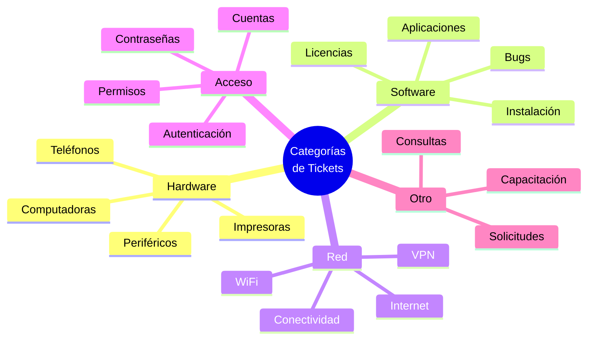

## 7. Flujo de Filtros y Búsqueda

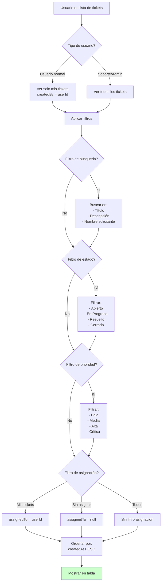

## 8. Modelo de Datos (Actual y Necesario)

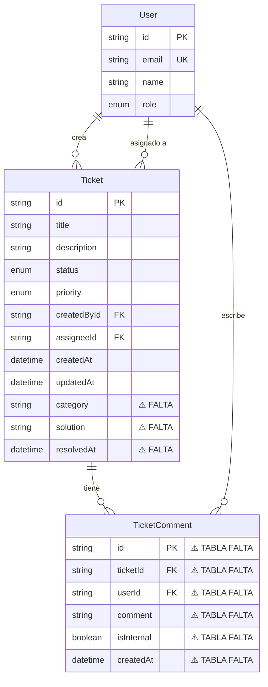

## 9. Sistema de Comentarios

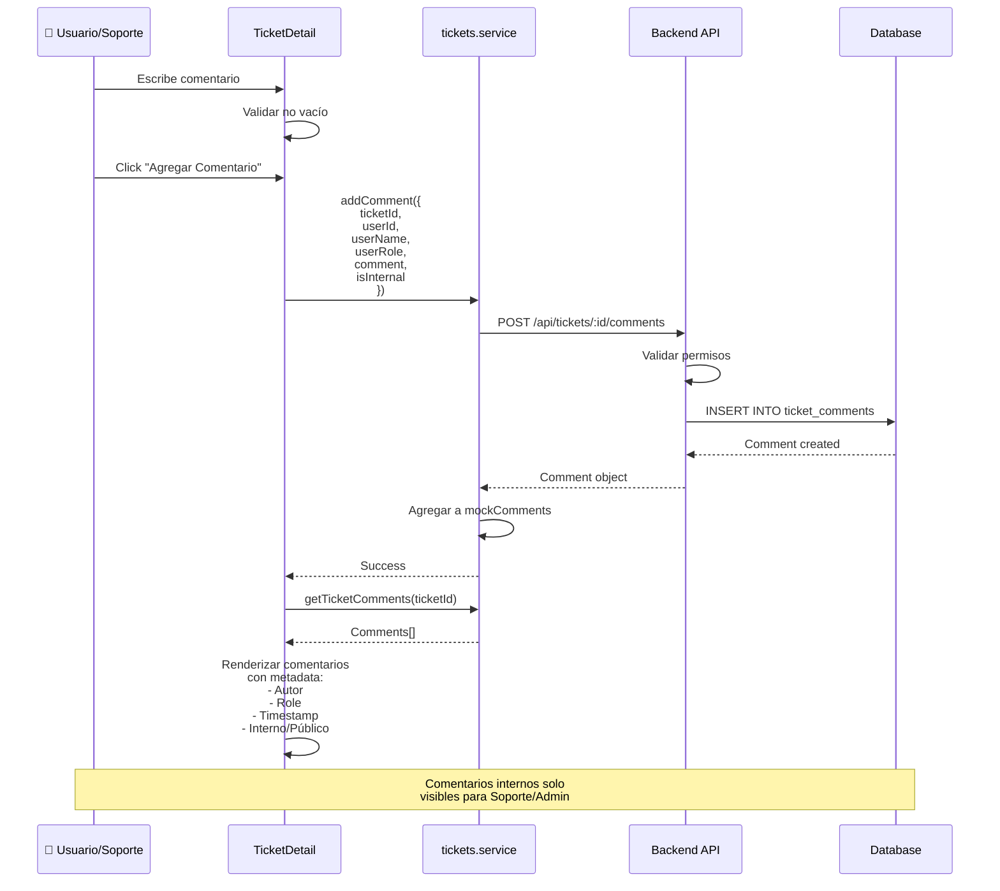

## 10. Permisos por Rol

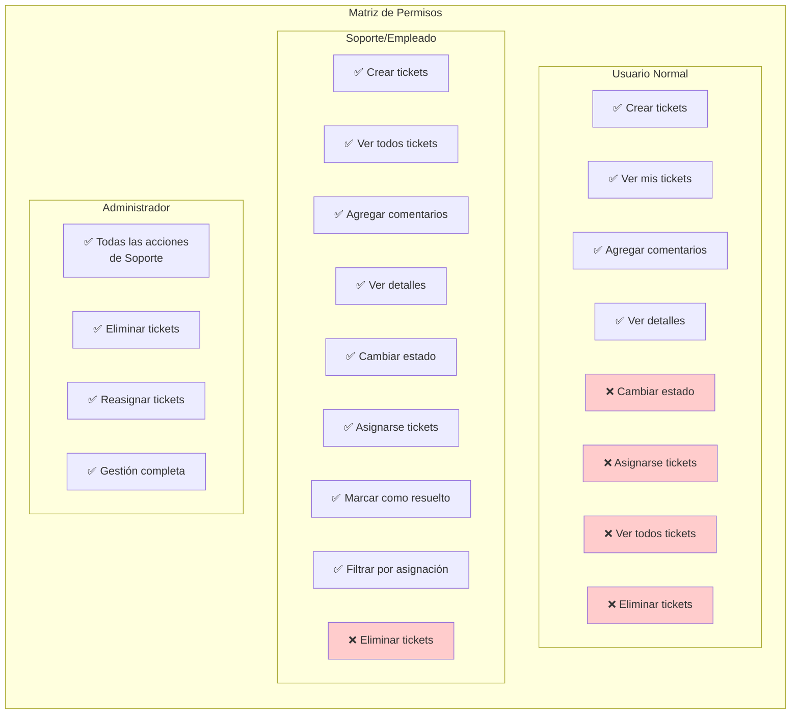

## 11. Integración con Dashboard

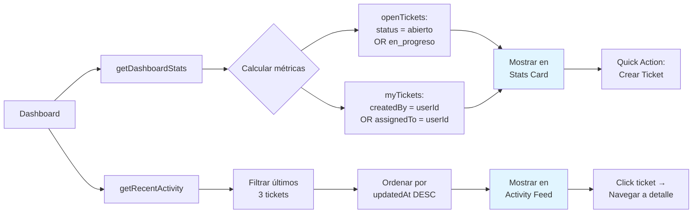

## Resumen Técnico

### Estado Actual
- ✅ **Frontend**: 100% funcional con mock data
- ⚠️ **Backend**: NO implementado
- ⚠️ **Database**: Schema básico, falta campos y tabla Comments

### Datos Mock (4 tickets de ejemplo)
```typescript
mockTickets: [
  { id: "1", status: "abierto", priority: "alta", category: "software" },
  { id: "2", status: "en_progreso", priority: "media", category: "hardware" },
  { id: "3", status: "resuelto", priority: "critica", category: "red" },
  { id: "4", status: "cerrado", priority: "baja", category: "acceso" }
]

mockComments: [
  { ticketId: "2", userName: "Juan Pérez", userRole: "empleado" },
  { ticketId: "3", userName: "Juan Pérez", userRole: "empleado" }
]
```

### Campos Faltantes en DB
1. ❌ `category` (enum: hardware, software, red, acceso, otro)
2. ❌ `solution` (text)
3. ❌ `resolvedAt` (timestamp)
4. ❌ Tabla `TicketComment` completa

### Endpoints Necesarios
- `POST /api/tickets` - Crear ticket
- `GET /api/tickets` - Listar con filtros
- `GET /api/tickets/:id` - Detalle
- `PATCH /api/tickets/:id` - Actualizar estado/solución
- `DELETE /api/tickets/:id` - Eliminar (ADMIN)
- `POST /api/tickets/:id/comments` - Agregar comentario
- `GET /api/tickets/:id/comments` - Listar comentarios

### Stack Tecnológico
- **Frontend**: Next.js 14, TypeScript, date-fns
- **Backend Pendiente**: NestJS, Prisma
- **Database**: PostgreSQL
- **UI**: shadcn/ui, Tailwind CSS
