# Diagramas de Flujo - Módulo de Gestión de Usuarios

## 1. Diagrama de Casos de Uso

```mermaid
graph TB
    Admin[👑 Administrador]
    Support[👨‍💻 Soporte/Empleado]
    User[👤 Usuario]

    subgraph "Módulo de Usuarios"
        UC1[Listar Usuarios]
        UC2[Ver Detalle Usuario]
        UC3[Crear Usuario]
        UC4[Editar Usuario]
        UC5[Cambiar Rol]
        UC6[Buscar Usuarios]
        UC7[Ver Perfil Propio]
        UC8[Cambiar Contraseña Propia]
    end

    Admin --> UC1
    Admin --> UC2
    Admin --> UC3
    Admin --> UC4
    Admin --> UC5
    Admin --> UC6

    Support --> UC7
    Support --> UC8

    User --> UC7
    User --> UC8

    style Admin fill:#e63946
    style Support fill:#457b9d
    style User fill:#a8dadc
    style UC3 fill:#ffe66d
    style UC4 fill:#ffe66d
    style UC5 fill:#ffe66d
```



## 2. Flujo de Creación de Usuario

```mermaid
sequenceDiagram
    actor Admin as 👑 Administrador
    participant UI as UserForm
    participant Service as users.service
    participant BFF as BFF /api/users
    participant Backend as NestJS Controller
    participant UService as UsersService
    participant DB as PostgreSQL

    Admin->>UI: Click "Nuevo Usuario"
    UI->>Admin: Mostrar formulario vacío

    Admin->>UI: Completa datos:<br/>- Nombre<br/>- Email<br/>- Contraseña<br/>- Rol (ADMIN/SUPPORT)

    UI->>UI: Validación cliente:<br/>- Email válido<br/>- Password min 6 chars<br/>- Nombre no vacío

    alt Validación exitosa
        UI->>Service: createUser({<br/>email, name,<br/>password, role<br/>})

        Service->>BFF: POST /api/users/create<br/>Authorization: Bearer JWT

        BFF->>BFF: Validar Zod<br/>CreateUserRequestSchema
        BFF->>Backend: POST /api/users/create<br/>Authorization: Bearer JWT

        Backend->>Backend: JwtAuthGuard valida JWT
        Backend->>Backend: RolesGuard verifica ADMIN

        Backend->>UService: create(createUserDto)

        UService->>DB: SELECT user<br/>WHERE email = ?

        alt Email ya existe
            DB-->>UService: Usuario encontrado
            UService-->>Backend: ConflictException<br/>409
            Backend-->>BFF: Error 409
            BFF-->>Service: Error
            Service-->>UI: "Email ya registrado"
        else Email disponible
            UService->>UService: bcrypt.hash(password, 10)
            UService->>DB: INSERT INTO users<br/>(email, name,<br/>password, role)
            DB-->>UService: Usuario creado

            UService->>UService: Excluir password<br/>de respuesta
            UService-->>Backend: User (sin password)

            Backend-->>BFF: User (role: ADMIN)
            BFF->>BFF: Transformar rol:<br/>ADMIN → admin<br/>SUPPORT → empleado
            BFF-->>Service: User (role: admin)

            Service-->>UI: Usuario creado
            UI->>UI: onSuccess()
            UI-->>Admin: Volver a lista<br/>Mostrar nuevo usuario
        end
    else Validación fallida
        UI-->>Admin: Mostrar errores<br/>en formulario
    end
```



## 3. Sistema de Roles y Permisos

```mermaid
graph TB
    subgraph "Roles del Sistema"
        R1[👑 ADMIN<br/>Administrador]
        R2[👨‍💻 SUPPORT<br/>Empleado/Soporte]
    end

    subgraph "Transformación de Roles"
        T1[Backend: ADMIN]
        T2[Backend: SUPPORT]
        T3[Frontend: admin]
        T4[Frontend: empleado]

        T1 -.->|BFF mapea| T3
        T2 -.->|BFF mapea| T4
    end

    subgraph "Permisos por Módulo"
        direction TB

        subgraph "ADMIN puede"
            A1[✅ Gestión de Usuarios]
            A2[✅ Gestión de Productos]
            A3[✅ Gestión de Tickets]
            A4[✅ Knowledge Base]
            A5[✅ Comunicaciones]
            A6[✅ Dashboard completo]
            A7[✅ TODAS las acciones]
        end

        subgraph "SUPPORT/Empleado puede"
            S1[❌ Gestión de Usuarios]
            S2[👁️ Ver Productos]
            S3[✅ Gestión de Tickets]
            S4[✅ Knowledge Base]
            S5[✅ Comunicaciones]
            S6[✅ Dashboard limitado]
            S7[✅ Ver/Editar perfil]
        end
    end

    R1 --> T1
    R2 --> T2

    T3 --> A1
    T3 --> A2
    T3 --> A3
    T3 --> A4
    T3 --> A5
    T3 --> A6
    T3 --> A7

    T4 --> S1
    T4 --> S2
    T4 --> S3
    T4 --> S4
    T4 --> S5
    T4 --> S6
    T4 --> S7

    style R1 fill:#e63946
    style R2 fill:#457b9d
    style S1 fill:#ffcccc
```



## 4. Arquitectura del Módulo de Usuarios

```mermaid
graph TB
    subgraph "Frontend - Next.js"
        Page[📄 users/page.tsx]
        List[📋 UserList]
        Form[📝 UserForm]

        Service[🔧 users.service.ts]
        Schemas[✅ user.schema.ts]
        Perms[🔐 permissions.ts]
        AuthCtx[🔑 AuthContext]
    end

    subgraph "BFF - Next.js API Routes"
        ListRoute[GET /api/users/list]
        CreateRoute[POST /api/users/create]
        GetByIdRoute[GET /api/users/getById/:id]
        UpdateRoute[PATCH /api/users/update/:id]
    end

    subgraph "Backend - NestJS"
        UController[🎮 UsersController]
        UService2[⚙️ UsersService]
        DTOs[📋 CreateUserDto]

        Guards[🛡️ Guards]
        JWTGuard[JwtAuthGuard]
        RolesGuard2[RolesGuard]
        RolesDecorator[@Roles ADMIN]

        subgraph "Database"
            Prisma[💾 Prisma ORM]
            DB[(PostgreSQL<br/>users table)]
        end
    end

    Page --> List
    Page --> Form
    List --> Service
    Form --> Service

    Service --> Schemas
    Service --> Perms
    Service --> AuthCtx

    Service --> ListRoute
    Service --> CreateRoute
    Service --> GetByIdRoute
    Service --> UpdateRoute

    ListRoute --> UController
    CreateRoute --> UController
    GetByIdRoute --> UController
    UpdateRoute --> UController

    UController --> JWTGuard
    UController --> RolesGuard2
    UController --> RolesDecorator

    JWTGuard --> UService2
    RolesGuard2 --> UService2
    RolesDecorator --> UService2

    UService2 --> DTOs
    UService2 --> Prisma
    Prisma --> DB

    style Page fill:#e1f5ff
    style UController fill:#ffe1e1
    style DB fill:#f0f0f0
```

## 5. Flujo de Actualización de Usuario

```mermaid
flowchart TD
    A[Admin click Editar] --> B[UserForm carga<br/>con datos usuario]

    B --> C{Email disabled<br/>Password oculto}
    C --> D[Admin modifica:<br/>- Nombre<br/>- Rol]

    D --> E[Submit form]
    E --> F{Validación Zod}

    F -->|Error| G[Mostrar errores]
    F -->|OK| H[updateUser id,<br/>{name?, role?}]

    H --> I[BFF valida y limpia<br/>undefined/null values]
    I --> J[PATCH /users/update/:id]

    J --> K[Backend valida JWT]
    K --> L{Es ADMIN?}

    L -->|No| M[403 Forbidden]
    L -->|Sí| N[UsersService.update]

    N --> O[Prisma UPDATE<br/>users SET<br/>name = ?,<br/>role = ?<br/>WHERE id = ?]

    O --> P[Excluir password]
    P --> Q[Retornar usuario<br/>actualizado]

    Q --> R[BFF transforma rol<br/>ADMIN → admin]
    R --> S[Frontend recibe<br/>usuario actualizado]

    S --> T[onSuccess]
    T --> U[Volver a lista]
    U --> V[Recargar usuarios]

    M --> W[Mostrar error]

    style L fill:#fff4e1
    style M fill:#ffcccc
    style V fill:#ccffcc
```

## 6. Modelo de Datos


## 7. Seguridad de Contraseñas


## 8. Protección de Rutas

```mermaid
flowchart TD
    A[Usuario accede /users] --> B{Middleware verifica<br/>cookie JWT}

    B -->|No hay token| C[Redirect /login]
    B -->|Token existe| D{Ruta es /users?}

    D -->|Sí| E[Decodificar JWT]
    E --> F{Role === ADMIN?}

    F -->|No| G[Redirect /dashboard<br/>Acceso denegado]
    F -->|Sí| H[Permitir acceso]

    H --> I[UsersPage carga]
    I --> J[useUserPermissions<br/>verifica permisos]

    J --> K{canCreate?}
    K -->|Sí| L[Mostrar botón<br/>Nuevo Usuario]
    K -->|No| M[Ocultar botón]

    L --> N[UserList renderiza]
    M --> N

    N --> O[API call con JWT<br/>en header]
    O --> P[Backend JwtAuthGuard]

    P --> Q{JWT válido?}
    Q -->|No| R[401 Unauthorized]
    Q -->|Sí| S[RolesGuard]

    S --> T{Role === ADMIN?}
    T -->|No| U[403 Forbidden]
    T -->|Sí| V[Procesar request]

    V --> W[Retornar datos]

    style C fill:#ffcccc
    style G fill:#ffcccc
    style R fill:#ffcccc
    style U fill:#ffcccc
    style W fill:#ccffcc
```



## 9. Validación en Múltiples Capas

```mermaid
graph TB
    subgraph "Capa 1: Frontend Form"
        F1[✅ Email válido]
        F2[✅ Password min 6]
        F3[✅ Nombre no vacío]
        F4[✅ Rol seleccionado]
    end

    subgraph "Capa 2: BFF Zod Schema"
        Z1[✅ CreateUserRequestSchema]
        Z2[✅ Email formato correcto]
        Z3[✅ Name min 2, max 100]
        Z4[✅ Password min 6]
        Z5[✅ Role ADMIN|SUPPORT]
    end

    subgraph "Capa 3: Backend DTO"
        B1[✅ CreateUserDto]
        B2[✅ @IsEmail]
        B3[✅ @IsNotEmpty name]
        B4[✅ @MinLength 6 password]
        B5[✅ @IsEnum Role]
    end

    subgraph "Capa 4: Database"
        D1[✅ Email UNIQUE constraint]
        D2[✅ NOT NULL constraints]
        D3[✅ Role enum check]
    end

    F1 --> Z1
    F2 --> Z1
    F3 --> Z1
    F4 --> Z1

    Z1 --> B1
    Z2 --> B1
    Z3 --> B1
    Z4 --> B1
    Z5 --> B1

    B1 --> D1
    B1 --> D2
    B1 --> D3

    style Z1 fill:#e1f5ff
    style B1 fill:#ffe1e1
    style D1 fill:#f0f0f0
```

## 10. Búsqueda de Usuarios


## 11. JWT Token Flow

```mermaid
flowchart TB
    subgraph "Login"
        A[Usuario login] --> B[Backend genera JWT]
        B --> C[Payload:<br/>- sub: userId<br/>- role: ADMIN/SUPPORT<br/>- email<br/>- name<br/>- exp: 15min]
        C --> D[Firma con<br/>JWT_ACCESS_SECRET]
        D --> E[Retornar accessToken]
    end

    subgraph "Almacenamiento"
        E --> F[Frontend guarda en:<br/>- localStorage<br/>- cookies 7 días]
    end

    subgraph "Uso en Requests"
        F --> G[API Client lee<br/>de localStorage]
        G --> H[Agrega header:<br/>Authorization:<br/>Bearer token]
        H --> I[Enviar request]
    end

    subgraph "Validación Backend"
        I --> J[JwtStrategy extrae token]
        J --> K[Verifica firma con<br/>JWT_ACCESS_SECRET]
        K --> L{Firma válida?}
        L -->|No| M[401 Unauthorized]
        L -->|Sí| N{Expirado?}
        N -->|Sí| M
        N -->|No| O[Retornar user payload]
        O --> P[Request.user = payload]
    end

    subgraph "Uso en Guards"
        P --> Q[RolesGuard lee<br/>user.role de Request]
        Q --> R[@Roles decorator<br/>especifica roles]
        R --> S{user.role in<br/>required roles?}
        S -->|No| T[403 Forbidden]
        S -->|Sí| U[Permitir acceso]
    end

    style M fill:#ffcccc
    style T fill:#ffcccc
    style U fill:#ccffcc
```

## 12. Comparación Backend vs Frontend


## Resumen Técnico

### Características Principales
1. ✅ **CRUD Completo**: Crear, Leer, Actualizar (NO Eliminar)
2. ✅ **Roles**: ADMIN y SUPPORT con permisos diferenciados
3. ✅ **Seguridad**: Passwords hasheados con bcrypt (10 rounds)
4. ✅ **JWT**: Tokens de 15 minutos con renovación
5. ✅ **Validación**: 4 capas (Frontend, BFF, Backend, DB)
6. ✅ **RBAC**: Control de acceso basado en roles
7. ✅ **BFF Pattern**: Transformación de datos entre backend y frontend

### Stack Tecnológico
- **Frontend**: Next.js 14, TypeScript, Zod, React
- **BFF**: Next.js API Routes
- **Backend**: NestJS, Prisma, Passport JWT, bcrypt
- **Database**: PostgreSQL
- **Auth**: JWT con estrategia Passport

### Endpoints Backend
- `GET /api/users/list` - Listar usuarios (ADMIN)
- `GET /api/users/getById/:id` - Ver usuario (ADMIN)
- `POST /api/users/create` - Crear usuario (ADMIN)
- `PATCH /api/users/update/:id` - Actualizar (ADMIN)
- `POST /api/auth/register` - Registrar (ADMIN)
- `POST /api/auth/login` - Login (Público)
- `GET /api/auth/me` - Usuario actual (Autenticado)

### Limitaciones Actuales
- ❌ No hay endpoint DELETE
- ❌ No se puede cambiar password desde UI
- ❌ No hay recuperación de contraseña
- ❌ No hay verificación de email
- ❌ No hay 2FA
- ❌ Tokens no se pueden revocar
